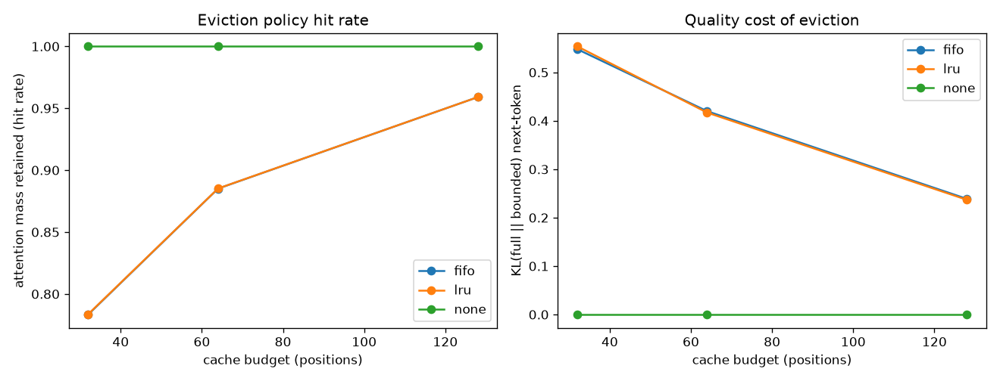

# kv-cache-throughput-bench

A from-scratch KV cache for autoregressive decoding, benchmarked against
recompute-every-step decoding, plus a study of bounded-cache eviction policies
(none / FIFO / LRU) measured by how much attention mass each policy preserves.

Trained model: https://huggingface.co/narinzar/tinygpt-shakespeare-kvcache

## Problem

Autoregressive generation recomputes attention over the whole prefix at every
step unless past keys and values are cached. The naive fix ("just cache K and
V") is easy to state but the payoff is not automatic: on a GPU the per-step
decode loop is dominated by kernel-launch overhead at small scale, and a fused
full-sequence attention kernel can beat a hand-rolled single-token cache until
the sequence is long enough for the quadratic recompute cost to dominate. On top
of that, an unbounded cache grows without limit, so real systems bound it and
evict - which raises the question this repo answers with numbers: how much does
eviction actually cost, and does the eviction policy matter?

## Approach

- Decoder-only transformer written from scratch (weight-tied embeddings,
  pre-norm blocks, learned absolute positions), with three attention code paths:
  fused full-sequence forward for training, single-token incremental decode with
  a per-layer KV cache, and an instrumented path that returns the query's
  attention distribution over past positions.
- A correctness test asserts that cached greedy decoding produces token-identical
  output to full recompute, so the cache is provably a pure speed optimization.
- Throughput is swept over sequence length for two model sizes to locate the
  crossover where caching starts to win, rather than reporting a single number.
- Eviction is framed as an attention-mass problem: the hit rate of a size-K cache
  is the fraction of the full attention distribution that lands on positions the
  policy kept. This is measured against the model's real attention, and paired
  with the actual next-token KL divergence versus full attention.
- My addition on top of the standard FIFO window: an LRU policy keyed on which
  past position received the most attention each step, plus a synthetic
  attention-sink stress test that isolates the workload where LRU separates from
  FIFO (real char-LM attention is too local to tell them apart).

## Setup

Requires an NVIDIA GPU with a recent driver. Tested on an RTX 5090 (Blackwell,
sm_120) with CUDA 12.8 wheels.

```
uv venv --python 3.12 .venv        # or: python -m venv .venv
# Windows: .venv\Scripts\activate    Linux/Mac: source .venv/bin/activate
uv pip install torch --index-url https://download.pytorch.org/whl/cu128
uv pip install -r requirements.txt
cp .env.example .env                # only needed to push the model to HF
```

`truststore` is imported at startup so HTTPS works behind a TLS-inspecting
proxy; on a normal network it is a no-op.

## How to run

```
python scripts/00_download_data.py      # fetch Tiny Shakespeare (~1.1 MB) into data/
python scripts/01_train.py --steps 2000 # train the char model, save outputs/tinygpt.pt
python scripts/02_bench_throughput.py   # cached vs uncached sweep -> outputs/throughput.json
python scripts/03_bench_eviction.py     # eviction study + plot -> outputs/eviction.{json,png}
python -m pytest tests/ -q
```

## Results

All numbers below are from a single RTX 5090 Laptop GPU run.

Model: 4 layers, 256-dim, 4 heads, char vocab 65, 3.307M params. Trained 2000
steps (block size 512, batch 48) in 134 s. Final validation loss 1.543
(perplexity 4.68). Greedy sample:

```
ANGELO:
I would not the season that they shall be they shall be they
To see the sea that they are they are they shall
```

### Throughput: cached vs uncached (tokens/sec, batch 1, greedy)

Small model (4L / 256d), where per-step launch overhead dominates:

| new tokens | uncached | cached | cached speedup |
|-----------:|---------:|-------:|---------------:|
| 128        | 828.9    | 660.7  | 0.80x          |
| 256        | 820.8    | 641.5  | 0.78x          |

Larger model (8L / 512d), where the quadratic recompute cost takes over:

| new tokens | uncached | cached | cached speedup |
|-----------:|---------:|-------:|---------------:|
| 256        | 417.8    | 346.8  | 0.83x          |
| 512        | 375.5    | 331.0  | 0.88x          |
| 1024       | 279.7    | 329.6  | 1.18x          |
| 2048       | 168.5    | 325.4  | 1.93x          |

The cached path holds a roughly flat ~330 tok/s while the uncached path decays
as O(T^2). The crossover is near 1024 generated tokens; at 2048 tokens caching
is 1.93x faster. At short lengths the fused full-sequence attention kernel plus
lower launch overhead makes recompute competitive, which is the honest reason a
naive from-scratch cache does not help a tiny model on short prompts.

### Eviction policies (trained model, 256 generated tokens)

Hit rate = fraction of full attention mass retained. KL = next-token
KL(full || bounded), lower is better.

| budget | policy | hit rate | KL vs full |
|-------:|--------|---------:|-----------:|
| 32     | fifo   | 0.783    | 0.548      |
| 32     | lru    | 0.784    | 0.554      |
| 64     | fifo   | 0.885    | 0.420      |
| 64     | lru    | 0.885    | 0.417      |
| 128    | fifo   | 0.959    | 0.239      |
| 128    | lru    | 0.959    | 0.237      |

FIFO and LRU are within 0.1% because char-LM attention is strongly local: the
useful keys are almost always the most recent ones, which both policies keep.
Shrinking the cache has a real, monotonic cost (KL 0.24 at budget 128 rising to
0.55 at budget 32).

### Where LRU separates from FIFO (synthetic attention-sink stress test)

With a persistent sink at position 0 (30% of attention mass) plus local
recency, budget 32:

| policy | hit rate |
|--------|---------:|
| fifo   | 0.738    |
| lru    | 1.000    |

FIFO evicts the sink as soon as it leaves the recent window; LRU keeps it
because it is re-attended every step. This is the workload (attention sinks,
long-range anchors) where an access-aware policy pays off.



## What I'd do next at larger scale

Swap the hand-rolled decode loop for CUDA graphs and a paged KV cache so
per-step launch overhead stops masking the caching win at short lengths, and run
the same sweep on a 1-3B model where the MLP cost per step makes caching win
much earlier. For eviction, I would test on a model with known attention sinks
and add a hybrid policy that pins the first few positions (sink) and runs LRU on
the rest, which the synthetic test suggests would beat both pure policies.
